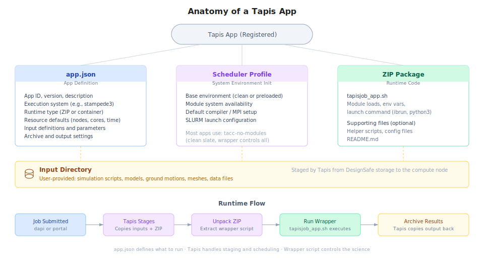

# DesignSafe Applications and Tapis

Every tool on DesignSafe, whether [OpenSees](https://opensees.berkeley.edu/), [OpenFOAM](https://www.openfoam.com/), [ADCIRC](https://adcirc.org/), or the general-purpose Agnostic App, is a **Tapis application**. Understanding what that means is the key to using DesignSafe effectively, and the foundation for building custom tools that are reproducible and shareable.

## What is a Tapis App?

A Tapis App is a packaged recipe for running software on [TACC](https://www.tacc.utexas.edu/) hardware. It bundles together everything needed to execute a simulation: which software to run, how to launch it, what inputs it expects, what resources it needs, and where to put the results.

When a researcher clicks "Submit" in the portal or calls `ds.jobs.submit()` in [dapi](https://designsafe-ci.github.io/dapi/), [Tapis](https://tapis.readthedocs.io/en/latest/) reads the app definition and handles the rest: copying input files to the compute system, generating a [SLURM](https://slurm.schedmd.com/documentation.html) batch script, submitting it to the scheduler, monitoring execution, and archiving the results back to [DesignSafe](https://designsafe-ci.org) storage.

This separation is what makes the system powerful. The researcher describes *what* to run. Tapis handles *how* and *where*.

## How existing apps work

All of the applications available in the DesignSafe portal are Tapis Apps. Each one was built by defining the same set of components described below, then registered with the Tapis API so it appears in the portal catalog.

| App | What it does | Why it is a Tapis App |
|---|---|---|
| `opensees-mp-s3` | Runs OpenSees-MP on Stampede3 | Defines the OpenSees module, MPI launch command, input/output staging |
| `openfoam-s3` | Runs OpenFOAM on Stampede3 | Handles case directory staging, decomposePar, parallel reconstruction |
| `adcirc-s3` | Runs ADCIRC on Stampede3 | Manages mesh inputs, MPI configuration, ensemble setup |
| `opensees-express` | Runs serial OpenSees on a VM | Uses FORK execution (no scheduler) on a dedicated VM |
| `designsafe-agnostic-app` | Runs any script (Python, Tcl, etc.) | User specifies binary, script, modules, and MPI flag as parameters |

When a researcher submits an OpenSees job through dapi:

```python
job_request = ds.jobs.generate(
    app_id="opensees-mp-s3",
    input_dir_uri=input_uri,
    script_filename="model.tcl",
    ...
)
```

`ds.jobs.generate()` fetches the `opensees-mp-s3` app definition from Tapis, fills in the researcher's inputs and resource requests, and produces a complete job request. The app definition already knows which execution system to use, which modules to load, and how to launch OpenSees with MPI.

## Inside a Tapis App



Every Tapis App is built from four components.

### 1. app.json (the definition)

A JSON file that tells Tapis everything about the app: its name, version, which execution system it runs on, what inputs and parameters it accepts, and what resource defaults to use. This is the contract between the app and Tapis.

```json
{
  "id": "my-opensees-app",
  "version": "1.0.0",
  "description": "Custom OpenSees analysis for bridge fragility",
  "runtime": "ZIP",
  "jobType": "BATCH",
  "execSystemId": "stampede3",
  "jobAttributes": {
    "nodeCount": 1,
    "coresPerNode": 48,
    "maxMinutes": 60,
    "fileInputs": [...],
    "parameterSet": {...}
  }
}
```

The [app.json reference](app-development/app-json.md) documents every field in detail.

### 2. Wrapper script (tapisjob_app.sh)

A shell script that contains the actual execution logic: loading software modules, setting environment variables, launching the simulation. This is the part the app developer controls.

```bash
#!/bin/bash

# Load the software
module load opensees

# Run the simulation
ibrun OpenSeesMP ${inputScript}
```

Tapis generates a companion script (`tapisjob.sh`) that handles SLURM directives, environment setup, and monitoring. The wrapper script is called from within that generated script. This two-script model separates Tapis concerns (scheduling, staging, archiving) from scientific concerns (which software to run and how).

The [wrapper scripts reference](app-development/wrapper-scripts.md) covers the two-script model, MPI configuration, and deployment patterns.

### 3. Runtime package

The app's executable code, delivered to the compute node. For most DesignSafe apps, this is a ZIP file containing the wrapper script and any supporting files. Tapis unpacks it on the compute node before execution. Apps can also use container images (Singularity/Apptainer) for fully reproducible environments.

### 4. Input directory (user-provided)

The researcher's files: simulation scripts, model definitions, ground motions, meshes. These are staged separately from the app code and placed in the working directory on the compute node.

## Why build a custom app?

The public apps on DesignSafe cover the most common tools and configurations. For many researchers, they are all that is needed. But a custom app makes sense when:

- The workflow requires non-standard software, flags, or module versions
- The analysis has custom pre-processing or post-processing steps baked into the execution
- A research group wants a standardized, reusable template for a specific type of study
- The workflow includes automated parameter sweeps, multi-stage pipelines, or conditional logic
- Reproducibility is critical: the app definition pins exact software versions, modules, and execution steps

A custom app is not a one-off script. It is a versioned, registered, shareable tool that any collaborator can run with `ds.jobs.submit()` or through the portal. Two researchers using the same app definition with the same inputs will get the same results on the same hardware. This is the foundation of reproducible computational research on DesignSafe.

## Creating a custom app

Building a custom app requires four steps.

### Step 1: Write the simulation code

Start with a working script (Python, Tcl, compiled binary) that runs correctly on a TACC system. Test it interactively in JupyterHub or through a small manual job before packaging it as an app.

### Step 2: Write the wrapper script

Create `tapisjob_app.sh` with the module loads and launch commands.

```bash
#!/bin/bash

# Load required modules
module load python3
module load opensees

# Run the analysis
python3 ${inputScript}
```

The wrapper should be non-interactive (no prompts), write all output to the current directory, and exit with a meaningful return code (0 for success).

### Step 3: Define app.json

Specify the app metadata, execution system, resource defaults, and input/parameter definitions.

```json
{
  "id": "my-research-group-app",
  "version": "1.0.0",
  "description": "Bridge fragility analysis with OpenSeesPy",
  "runtime": "ZIP",
  "runtimeOptions": ["--tapis-profile tacc-no-modules"],
  "jobType": "BATCH",
  "execSystemId": "stampede3",
  "jobAttributes": {
    "execSystemExecDir": "${JobWorkingDir}",
    "execSystemInputDir": "${JobWorkingDir}",
    "execSystemOutputDir": "${JobWorkingDir}/output",
    "nodeCount": 1,
    "coresPerNode": 48,
    "maxMinutes": 120,
    "fileInputs": [
      {
        "name": "Input Directory",
        "inputMode": "REQUIRED",
        "sourceUrl": "",
        "targetPath": "*"
      }
    ],
    "parameterSet": {
      "appArgs": [
        {
          "name": "Input Script",
          "arg": "analysis.py",
          "inputMode": "REQUIRED"
        }
      ]
    }
  }
}
```

### Step 4: Register and test

Upload the ZIP package (wrapper script + any supporting files) to DesignSafe storage, then register the app using the Tapis Python client.

```python
from tapipy.tapis import Tapis

t = Tapis(base_url="https://designsafe.tapis.io")
t.get_tokens()

import json
with open("app.json") as f:
    app_def = json.load(f)

t.apps.createAppVersion(**app_def)
```

Once registered, the app can be used immediately through dapi or the portal.

```python
from dapi import DSClient

ds = DSClient()
input_uri = ds.files.to_uri("/MyData/bridge-study/input/")

job_request = ds.jobs.generate(
    app_id="my-research-group-app",
    input_dir_uri=input_uri,
    script_filename="analysis.py",
    allocation="your_allocation",
)

job = ds.jobs.submit(job_request)
job.monitor()
```

The [app development tutorial](app-development/overview.md) provides a more detailed walkthrough with complete code examples, GUI submission instructions, and deployment tips.

## Versioning and reproducibility

Every app has an ID and a version (e.g., `my-app` version `1.0.0`). When the app is updated, the version number changes. Old versions remain available, so published research can always point to the exact app version used to produce the results.

Best practices for maintaining apps:

- Use [semantic versioning](https://semver.org/) (major.minor.patch)
- Keep a changelog documenting what changed in each version
- Pin module versions in the wrapper script (`module load opensees/3.7.0` not `module load opensees`)
- Test new versions against known results before publishing

## Reference

- [App development tutorial](app-development/overview.md) for the full step-by-step guide
- [app.json schema reference](app-development/app-json.md) for every field in the app definition
- [Wrapper scripts reference](app-development/wrapper-scripts.md) for the two-script model, MPI patterns, and deployment
- [Glossary](glossary.md) for Tapis and DesignSafe terminology
- [Tapis documentation](https://tapis.readthedocs.io/en/latest/) for the complete API reference
