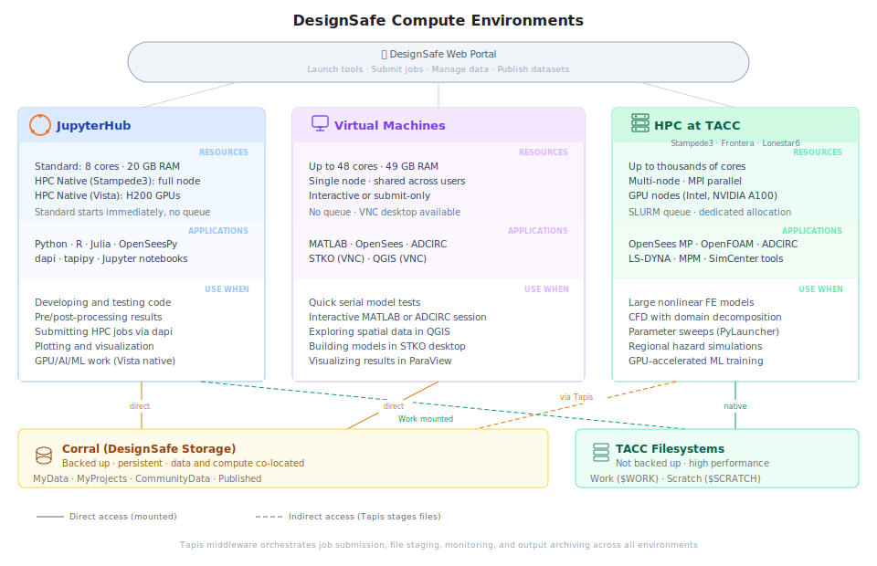

# Computational Workflows on DesignSafe

[DesignSafe](https://designsafe-ci.org) brings together the computational power of the [Texas Advanced Computing Center (TACC)](https://www.tacc.utexas.edu/) with cloud-based interfaces, allowing researchers to move between interactive exploration and large-scale, production-level computation. Whether testing a small Python script in a Jupyter notebook or deploying thousands of simulations across TACC HPC systems, the platform scales from one core to tens of thousands.

DesignSafe supports the full life cycle of computational research: developing models and scripts, running and monitoring simulations, managing input and output data, and sharing or reproducing results. All of this happens through a browser. The platform handles the details of moving files to the right place, submitting jobs to the right machine, and collecting results when they finish.

This page explains how DesignSafe works and how the pieces fit together. The rest of the guide covers specific tasks: [submitting jobs](job-resources.md), [debugging failures](debugging.md), [parallel computing](parallel-computing.md), and [parameter sweeps](parameter-sweeps.md).

## The DesignSafe Portal

Everything starts at the [DesignSafe web portal](https://www.designsafe-ci.org/rw/workspace/). The portal is the single entry point for launching compute environments, submitting jobs, and managing data. From the workspace, researchers can open a [JupyterHub](https://jupyter.designsafe-ci.org) notebook, start an interactive application like [MATLAB](https://www.mathworks.com/products/matlab.html) or [QGIS](https://qgis.org/), submit a batch simulation to an HPC cluster, or browse and publish datasets in the [Data Depot](https://designsafe-ci.org/user-guide/datadepot/).

Researchers can also bypass the portal and submit jobs programmatically from a Jupyter notebook using [dapi](https://designsafe-ci.github.io/dapi/). This is the preferred approach for automated pipelines, parameter sweeps, and reproducible workflows.

## How a job gets from you to the supercomputer

Three layers connect a researcher's browser to TACC hardware.

**Interface layer.** The researcher works in the portal or a JupyterHub notebook. The portal launches tools, submits jobs, and manages data through a browser. JupyterHub provides an interactive Python/R environment for writing code, testing models, and submitting jobs programmatically through dapi.

**Middleware layer.** [Tapis](https://tapis.readthedocs.io/en/latest/) sits between the interface and TACC hardware. When a job is submitted, Tapis copies input files to the execution system, generates a scheduler script, submits it, monitors execution, and copies results back. The researcher never writes scheduler scripts or transfers files manually.

**Execution layer.** [SLURM](https://slurm.schedmd.com/documentation.html) is the job scheduler on all TACC systems. It manages a queue, allocates hardware fairly across thousands of researchers, enforces time limits, and tracks resource usage. Every DesignSafe job that runs on HPC is a SLURM job, whether submitted through the portal, dapi, or direct SSH.

## Three compute environments

DesignSafe provides three places where computation can happen. Each serves a different purpose.

**JupyterHub** is where most day-to-day work happens. Each session gets a dedicated container (up to 8 CPU cores, 20 GB RAM) that starts immediately with no queue wait. Researchers write code, test models, visualize results, and submit HPC jobs from here. For heavier interactive work, Jupyter HPC Native sessions run directly on [Stampede3](https://docs.tacc.utexas.edu/hpc/stampede3/) or Vista GPU nodes with full node resources, though these go through the SLURM queue.

**Virtual machines** run applications that need an interactive session without a queue wait. [OpenSees](https://opensees.berkeley.edu/) Interactive, [MATLAB](https://www.mathworks.com/products/matlab.html), [ADCIRC](https://adcirc.org/) Interactive, [STKO](https://asdeasoft.net/stko/), and [QGIS](https://qgis.org/) all run on shared VMs at TACC. STKO and QGIS provide a full graphical desktop through [NICE DCV](https://docs.tacc.utexas.edu/tutorials/remotedesktopaccess/), which streams a remote desktop to the browser. VMs share hardware across users, so they work best for lightweight tasks and quick tests.

**HPC systems** handle production-scale computation. Stampede3, [Frontera](https://docs.tacc.utexas.edu/hpc/frontera/), and [Lonestar6](https://docs.tacc.utexas.edu/hpc/lonestar6/) are clusters of interconnected machines (nodes), each with dozens of CPU cores and hundreds of gigabytes of memory. Jobs can span multiple nodes. SLURM manages the queue. Long-running simulations, multi-core parallel analyses, and parametric sweeps with hundreds of runs all belong on HPC. Even when launched through the portal's graphical forms, HPC jobs are batch jobs that run unattended.

### Which environment for what

| What you need to do | Environment | Example |
|---|---|---|
| Write and test code, visualize results | JupyterHub | Developing a post-processing script, plotting response spectra |
| Interactive GUI session | VM (DCV desktop) | Building a mesh in STKO, exploring spatial data in QGIS |
| Quick serial test | VM | Testing an OpenSees Tcl model, short MATLAB analysis |
| Large or long-running simulation | HPC batch | Nonlinear time-history analysis, ADCIRC storm-surge forecast |
| Hundreds of independent runs | HPC with [PyLauncher](https://github.com/TACC/pylauncher) | Fragility study across 500 ground-motion records |
| Parallel simulation across many cores | HPC with [MPI](https://www.mpi-forum.org/) | Multi-node [OpenFOAM](https://www.openfoam.com/) CFD, ADCIRC with millions of elements |
| GPU-accelerated work | Jupyter HPC Native (Vista) or GPU queue | ML training, GPU-accelerated simulation |

Most researchers follow a natural progression: develop and test interactively in JupyterHub, then submit production runs as batch jobs to HPC.

## Data and compute live together

Research data and compute hardware are co-located at TACC. A ground-motion database in CommunityData can be referenced directly from a simulation job without downloading it to a laptop and re-uploading it to the cluster. This is one of DesignSafe's most important advantages.

DesignSafe provides several storage areas with different tradeoffs between persistence and performance.

| Storage area | Purpose | Backed up |
|---|---|---|
| MyData | Private files (scripts, inputs, outputs) | Yes |
| MyProjects | Shared project files visible to collaborators | Yes |
| Work | Active workspace on the HPC system | No |
| Scratch | Temporary high-speed storage on HPC | No (purged) |
| CommunityData | Public datasets shared across DesignSafe | Yes |
| Published | Archived datasets with DOIs | Yes |

MyData and MyProjects live on Corral, TACC's backed-up storage. Work and Scratch are fast but not backed up. Always copy important results to MyData or MyProjects when a job finishes.

When a job is submitted, Tapis automatically stages input files to the execution system before the job starts, and archives output back to DesignSafe storage after completion. There is no manual file transfer step. [Running HPC Jobs](job-resources.md) covers the details of storage paths, file staging, and transfer strategies.

## Designing your workflow

A workflow should be designed around the research question, not around a specific tool. The most effective approach is to keep each stage modular.

1. **Input generation** prepares models, parameters, ground motions, or meshes.
2. **Execution** runs the simulation, ensemble, or training loop.
3. **Post-processing** extracts results, computes statistics, and generates figures.
4. **Iteration** repeats execution across parameter sets, Monte Carlo samples, or convergence loops.

When these stages are separate, each can be reused across projects, swapped to a different environment, or combined in new ways. A mesh generator can change without touching the solver. The execution stage can move from JupyterHub to HPC without rewriting the post-processing code.

Scalability follows from this structure. But different workloads scale differently, and the right strategy depends on the problem.

| Workload pattern | How it scales | Example |
|---|---|---|
| Many independent runs | Add more tasks to a single allocation ([PyLauncher](https://github.com/TACC/pylauncher)) | Fragility study with 500 ground-motion records |
| One large model | Divide the domain across cores with MPI | 3D nonlinear structural analysis, ADCIRC storm surge |
| Memory-bound analysis | Use nodes with more RAM or fewer cores per node | Large stiffness matrix assembly |
| GPU-accelerated work | Use GPU queues on Stampede3 or Lonestar6 | ML training, dense linear algebra |

Matching the workload to the right strategy matters more than choosing the biggest machine. [Parallel Computing](parallel-computing.md) and [Parameter Sweeps](parameter-sweeps.md) cover these scaling strategies in detail.

## Where to go next

| I want to... | Read |
|---|---|
| Submit a job to HPC | [Running HPC Jobs](job-resources.md) |
| Figure out why my job failed | [Debugging Failed Jobs](debugging.md) |
| Run a simulation across many cores | [Parallel Computing](parallel-computing.md) |
| Run hundreds of independent simulations | [Parameter Sweeps](parameter-sweeps.md) |
| See what applications are available | [DesignSafe Applications](../apps/overview.md) |
| Understand Tapis internals or build a custom app | [Advanced Topics](../advanced/tapis.md) |
