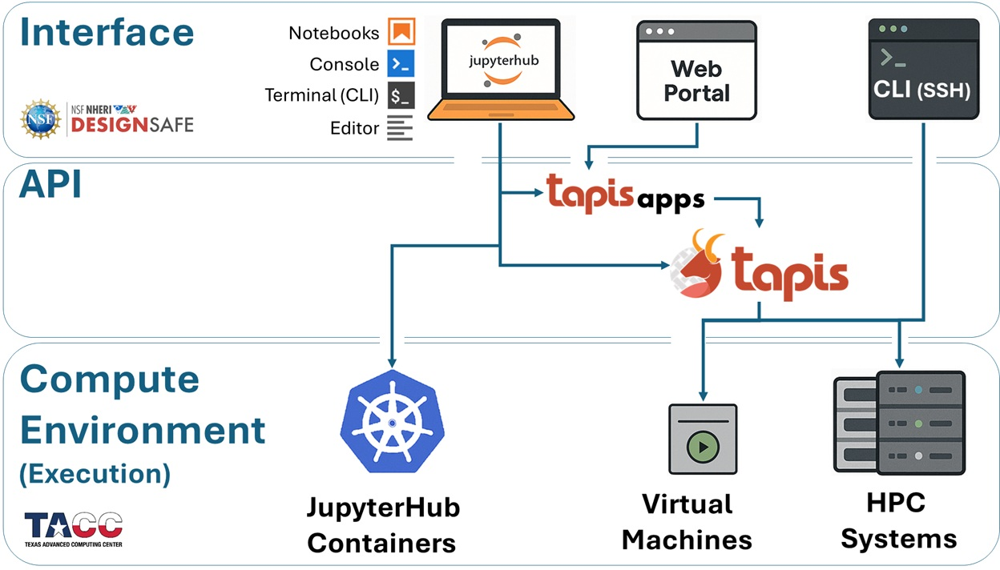

# Running HPC Jobs

This page walks through submitting a simulation to [TACC](https://www.tacc.utexas.edu/) supercomputers through [DesignSafe](https://designsafe-ci.org): how jobs flow through the system, how to submit one, serial vs parallel execution, and how to choose the right resources. For HPC system specs, queues, and allocations, see [Compute Environments](compute-environments.md).

## Two ways to submit a job

DesignSafe provides two paths to submit an HPC job. Both produce the same result.

**The web portal.** From the [DesignSafe workspace](https://www.designsafe-ci.org/rw/workspace/), select an application (such as OpenSees or OpenFOAM), fill in a form with input files and resource settings, and click Submit. This works well for one-off runs and getting started.

**dapi from a Jupyter notebook.** [dapi](https://designsafe-ci.github.io/dapi/) is a Python library that submits jobs programmatically. Instead of clicking through a form, a few lines of code describe the job, submit it, monitor its progress, and retrieve results. This is the preferred approach when running many jobs, building reproducible workflows, or automating parameter studies.

Both methods use [Tapis](https://tapis.readthedocs.io/en/latest/) behind the scenes. Tapis is the middleware that connects the DesignSafe interface to TACC hardware. It copies input files to the execution system, generates a [SLURM](https://slurm.schedmd.com/documentation.html) scheduler script, submits it, monitors the job, and copies results back. The researcher never writes SLURM scripts or transfers files manually.

## How a job moves through the system



Every HPC job follows the same sequence, regardless of how it was submitted.

1. **Submit.** The researcher describes the job (application, input files, resources) and submits it through the portal or dapi.
2. **Stage inputs.** Tapis copies input files from DesignSafe storage to the execution system. This happens before the SLURM job starts and does not count against the walltime.
3. **Generate and queue.** Tapis creates a SLURM batch script and submits it. The job enters the queue.
4. **Execute.** When the requested nodes become available, SLURM launches the application. The simulation runs and writes output to a working directory on the compute system.
5. **Archive.** After completion, Tapis copies results back to DesignSafe storage.
6. **Retrieve.** The researcher accesses results from JupyterHub, the portal, or dapi.

The wait between steps 3 and 4 is queue time. Development queues typically start within minutes. A large production job may wait longer depending on system load.

## End-to-end example with dapi

This example submits an OpenSees parallel analysis to Stampede3, monitors it, and retrieves the results. It runs from a Jupyter notebook on DesignSafe.

### Step 1: Set up and authenticate

```python
from dapi import DSClient

ds = DSClient()
```

`DSClient()` creates an authenticated connection to DesignSafe services. On JupyterHub, authentication happens automatically.

### Step 2: Point to your input files

```python
input_uri = ds.files.to_uri("/MyData/opensees/site-response/")
```

This converts a DesignSafe path (as seen in the Data Depot) into a Tapis URI that the job submission system requires. The directory should contain the OpenSees script and any supporting files (ground motions, material definitions, etc.).

### Step 3: Generate the job request

```python
import json

job_request = ds.jobs.generate(
    app_id="opensees-mp-s3",
    input_dir_uri=input_uri,
    script_filename="Main.tcl",
    node_count=1,
    cores_per_node=16,
    max_minutes=30,
    allocation="your_allocation",
    queue="skx",
)

print(json.dumps(job_request, indent=2, default=str))
```

`ds.jobs.generate()` builds a complete Tapis job request using the app's defaults, then overrides the fields specified above. Printing the result lets you verify the configuration before submitting.

| Parameter | What it means |
|---|---|
| `app_id` | Which application to run (see [app_id reference](../apps/overview.md#tapis-app-ids)) |
| `input_dir_uri` | Tapis URI of the input files (use `ds.files.to_uri()` to convert) |
| `script_filename` | The main script file in the input directory |
| `node_count` | Number of physical machines to allocate |
| `cores_per_node` | CPU cores per node (total cores = node_count x cores_per_node) |
| `max_minutes` | Wall-clock time limit. SLURM kills jobs that exceed it. |
| `allocation` | The TACC project account charged for the job |
| `queue` | Which queue to submit to (see [Compute Environments](compute-environments.md#slurm-and-queues)) |

### Step 4: Submit and monitor

```python
job = ds.jobs.submit(job_request)
print(f"Job UUID: {job.uuid}")

job.monitor(interval=15)
```

`ds.jobs.submit()` sends the request to Tapis and returns a job object. `job.monitor()` polls the job status every 15 seconds and prints each state transition (PENDING, STAGING_INPUTS, QUEUED, RUNNING, ARCHIVING, FINISHED) until the job completes. The job UUID is a unique identifier that can be used to reconnect later.

### Step 5: List and retrieve results

```python
job.list_outputs()
```

After the job finishes, Tapis archives output files back to DesignSafe storage. `list_outputs()` shows what was produced. Results can be accessed directly from JupyterHub at the archive path, or downloaded with `job.get_output_content()`.

## What dapi generates behind the scenes

The `ds.jobs.generate()` call above produces a Tapis job request. Tapis converts it into a SLURM batch script equivalent to:

```bash
#!/bin/bash
#SBATCH -A your_allocation
#SBATCH -p skx
#SBATCH -N 1
#SBATCH -n 16
#SBATCH -t 00:30:00
# ... module loads, file staging, execution commands ...
```

There is no need to write this script by hand. Tapis generates it automatically from the job request parameters.

## Serial vs parallel jobs

Most HPC workloads on DesignSafe fall into one of three patterns. The distinction determines how to set `node_count` and `cores_per_node`.

**Serial jobs** run a single process on one core. A standalone OpenSeesPy script, a MATLAB analysis, or a Python post-processing script are serial. Set `node_count=1` and `cores_per_node=1` (or a small number if the application uses internal threading).

**Embarrassingly parallel jobs** run many independent serial tasks that do not communicate with each other. A fragility study running the same model across 500 ground-motion records is a classic example. Each task gets its own inputs, produces its own outputs, and can succeed or fail independently. Use [PyLauncher](https://github.com/TACC/pylauncher) inside a single SLURM allocation to dispatch all tasks efficiently. See [Parameter Sweeps](parameter-sweeps.md).

**MPI parallel jobs** run one large model split across many cores that must communicate during execution. Each core runs a process called a **rank**. Ranks work on different parts of the problem (for example, different regions of a finite-element mesh) and exchange data with their neighbors through [MPI](https://www.mpi-forum.org/) (Message Passing Interface). This splitting is called **domain decomposition**. [OpenSees](https://opensees.berkeley.edu/) MP, [ADCIRC](https://adcirc.org/), [OpenFOAM](https://www.openfoam.com/), and MPM all use MPI internally.

| Job type | `node_count` | `cores_per_node` | Example |
|---|---|---|---|
| Serial | 1 | 1 | OpenSeesPy script, MATLAB analysis |
| Embarrassingly parallel (PyLauncher) | 1 | 48 (one task per core) | 500-run fragility study |
| MPI parallel | 2 | 48 (96 total ranks) | OpenSees MP with 96 subdomains |

Researchers using MPI applications do not write MPI code themselves. The application handles the parallelism internally. The researcher's role is to request the right number of nodes and cores so the total rank count matches the model's domain decomposition. If an OpenSees MP model is partitioned into 96 subdomains, the job must request exactly 96 total cores (for example, 2 nodes x 48 cores).

### Submitting a parallel job

A parallel job looks the same as any other dapi submission, with `node_count` and `cores_per_node` set to match the problem:

```python
job_request = ds.jobs.generate(
    app_id="opensees-mp-s3",
    input_dir_uri=input_uri,
    script_filename="analysis.tcl",
    node_count=2,
    cores_per_node=48,
    max_minutes=120,
    allocation="your_allocation",
    queue="skx",
)
```

This produces 96 MPI ranks (2 x 48). If the rank count does not match the model's decomposition, the simulation will either fail or produce incorrect results.

### Ranks and how they map to hardware

When an MPI program starts, SLURM launches multiple copies of it. Each copy is a rank with a unique integer ID from 0 through N-1. Requesting 2 nodes with 48 cores each produces 96 ranks. Rank 0 might process the left portion of a structural mesh, rank 47 the right portion on the first node, and ranks 48 through 95 cover the second node.

SLURM sets environment variables that a program can read to determine its identity:

| Variable | Meaning |
|---|---|
| `SLURM_PROCID` | Global MPI rank ID (0 through N-1) |
| `SLURM_LOCALID` | Rank index within the current node |
| `SLURM_NODEID` | Node index within the job allocation |
| `SLURM_JOB_ID` | Scheduler job identifier |

### Rank-aware file management

Two ranks writing to the same filename will overwrite each other, producing corrupted output or silently wrong results. Use the rank ID in output file paths to prevent collisions.

```python
import os

rank = os.environ.get("SLURM_PROCID", "0")
output_file = f"results_rank{rank}.txt"
```

All ranks on the same node share the same `/tmp` directory, so even temporary files need rank-based naming.

## Modules and ibrun

TACC uses **environment modules** to manage software installations. Multiple versions of the same software can coexist on a system, and `module load` activates a specific version by setting the right paths and environment variables. For example, `module load opensees/3.7.0` makes that version of OpenSees available on the compute node.

When using DesignSafe apps through dapi or the portal, module loading is handled automatically by the app's wrapper script. Researchers writing custom apps or wrapper scripts need to include the appropriate `module load` commands.

On TACC systems, **`ibrun`** is the correct way to launch MPI applications. It is a TACC-specific wrapper around the MPI launcher that correctly handles process placement across nodes. Using `mpirun` or `mpiexec` directly on TACC systems can produce unexpected behavior. If you see MPI errors in `tapisjob.err` mentioning hostfiles or daemon startup failures, check that `ibrun` is being used.

## Login nodes vs compute nodes

TACC systems have two types of machines. **Login nodes** are shared entry points where researchers land after connecting via SSH or JupyterHub. They are for editing files, submitting jobs, and light scripting. Running a simulation directly on a login node slows the machine for everyone and may be killed automatically.

**Compute nodes** are the machines that actually run jobs. They are accessed only through SLURM. When a job is submitted, SLURM assigns it to one or more compute nodes, and the simulation runs there in isolation. The job's environment (modules, environment variables, working directory) is set up on the compute node, not the login node. This distinction matters when debugging: a command that works in a JupyterHub terminal (login node) may fail inside a job (compute node) if the required modules or paths are different.

## Storage during job execution

Tapis stages input files to the execution system's Work filesystem before the job starts and archives output back to DesignSafe storage after completion. For production simulations, always use Work or Scratch rather than running against MyData. Work and Scratch are on a fast parallel filesystem and perform significantly better for I/O-heavy jobs. See [Storage and File Management](storage.md) for details on storage areas, paths, and why the performance differs.

### Node-local storage

For I/O-intensive jobs, copying data to `/tmp` on the compute node avoids shared-filesystem contention entirely. Each node has its own `/tmp` partition. It is not shared across nodes and is purged at the end of each job.

| System | Node Type | /tmp Size |
|---|---|---|
| Stampede3 | SKX | 90 GB |
| Stampede3 | ICX | 200 GB |
| Stampede3 | SPR | 150 GB |
| Stampede3 | PVC / H100 | 3.5 TB |
| Frontera | CLX | 144 GB |
| Lonestar6 | All | 288 GB |

```bash
RANK="${SLURM_PROCID:-0}"
SCRATCH_DIR="/tmp/${USER}/job_${SLURM_JOB_ID}/rank_${RANK}"
mkdir -p "${SCRATCH_DIR}"

cp input_${RANK}.dat "${SCRATCH_DIR}/"
cd "${SCRATCH_DIR}"
./solver input_${RANK}.dat > output_${RANK}.dat

# Copy results back before the job ends
cp output_${RANK}.dat "${TAPIS_JOB_WORKDIR}/"
```

Use the shared filesystem (Work/Scratch) for inputs, final outputs, and checkpoints. Use `/tmp` only for high-frequency scratch I/O and intermediate files.

## What does your job need?

Before choosing resources, ask what the job actually requires. Most jobs on DesignSafe fit one of these patterns.

| Situation | What to request | Why |
|---|---|---|
| One model that fits on a single node | 1 node, 1 core (or a few for threaded apps) | Serial execution, no MPI overhead |
| One model too large for a single node | Multiple nodes, cores matched to domain decomposition | MPI splits the problem across ranks |
| Many independent models (parameter study) | 1 node, many cores, [PyLauncher](https://github.com/TACC/pylauncher) | Each core runs one independent task |
| Model needs lots of memory per process | 1 node, fewer cores per node | Fewer processes means more RAM per process |
| Model needs GPUs | GPU queue (`pvc` on Stampede3, `gpu-a100` on Lonestar6) | GPU-accelerated solvers or ML training |
| Simulation is slow despite enough cores | Check I/O, not just CPU | Moving data to `/tmp` or Work may help more than adding cores |

If the job is I/O-bound (spending most of its time reading or writing files rather than computing), adding more cores will not help. Move data to faster storage (Work, Scratch, or `/tmp`) first. If the job is memory-bound (crashing with out-of-memory errors or swapping), reduce cores per node to give each process more RAM, or use a node type with more memory (ICX at 256 GB, NVDIMM at 4 TB).

## Resource sizing guidance

For node types, queue specifications, and allocation billing, see [Compute Environments](compute-environments.md).

**Start small.** Run the model in the development queue with a short walltime and a single node. A 10-minute test on `skx-dev` costs almost nothing and catches most configuration errors before they waste hours of allocation time.

**Match cores to the problem.** For MPI jobs, total ranks = node_count x cores_per_node. If a model is decomposed into 96 subdomains, request 2 nodes with 48 cores each. For serial jobs or PyLauncher sweeps, one node is usually enough.

**Watch memory per core.** All cores on a node share the same RAM. If each MPI process needs 8 GB and the node has 192 GB, running all 48 cores gives only about 4 GB per process. Requesting fewer cores per node gives each process more memory. See the [memory-per-core table](compute-environments.md#nodes-cores-and-memory) for specifics.

**Add margin to walltime.** If a simulation takes 30 minutes on a test run, request 45-60 minutes for production to account for variability. SLURM kills jobs that exceed their time limit.
