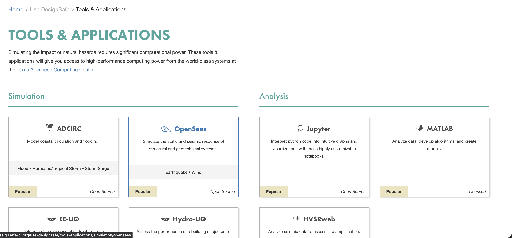
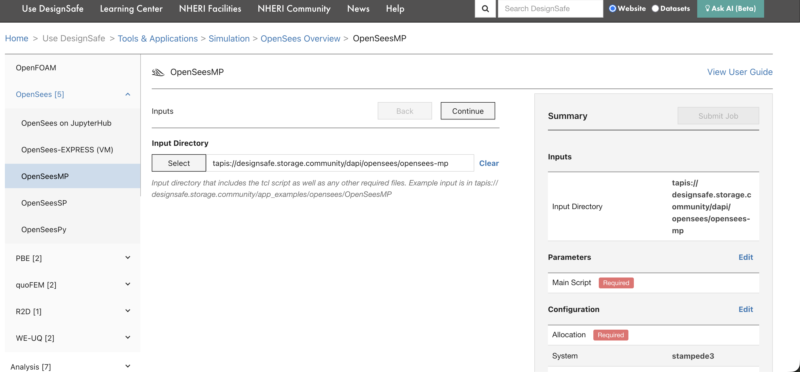
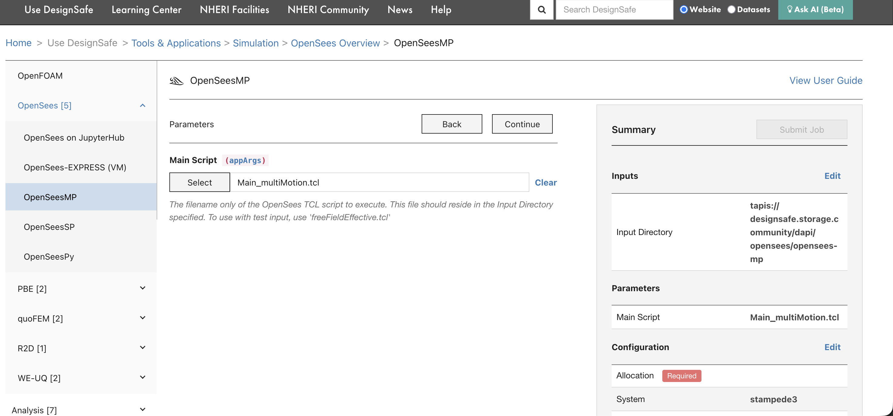
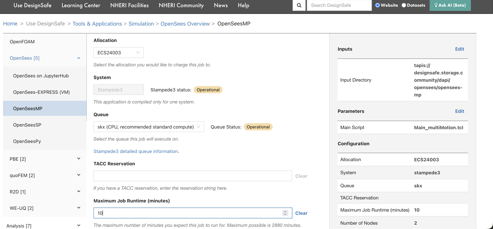
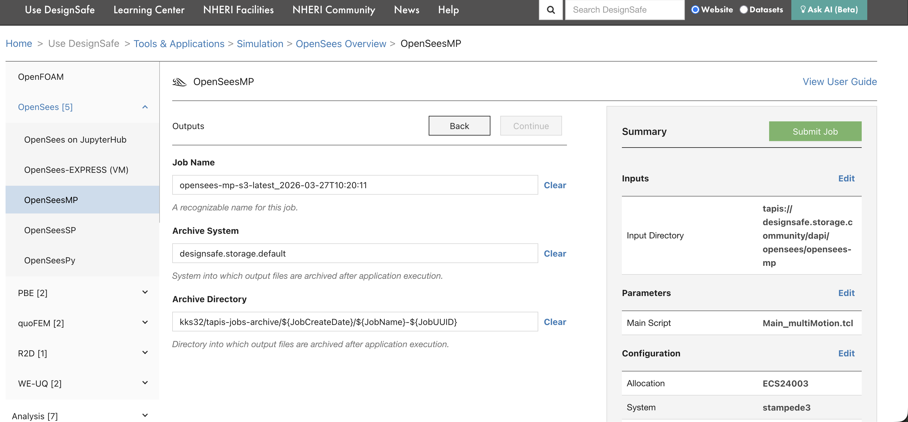
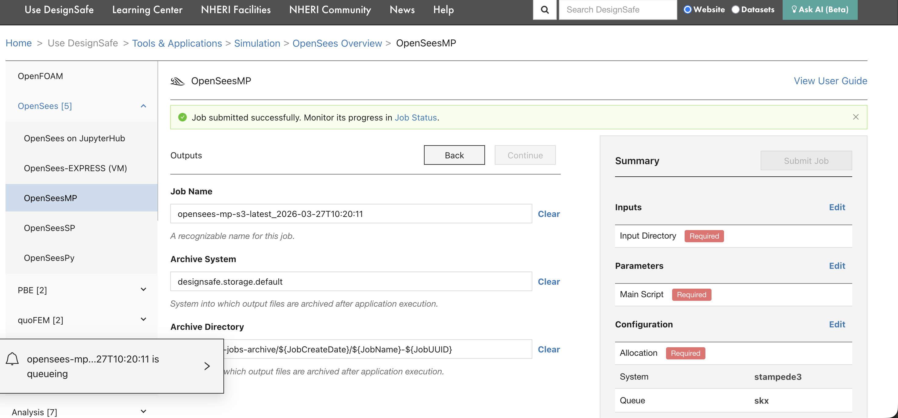
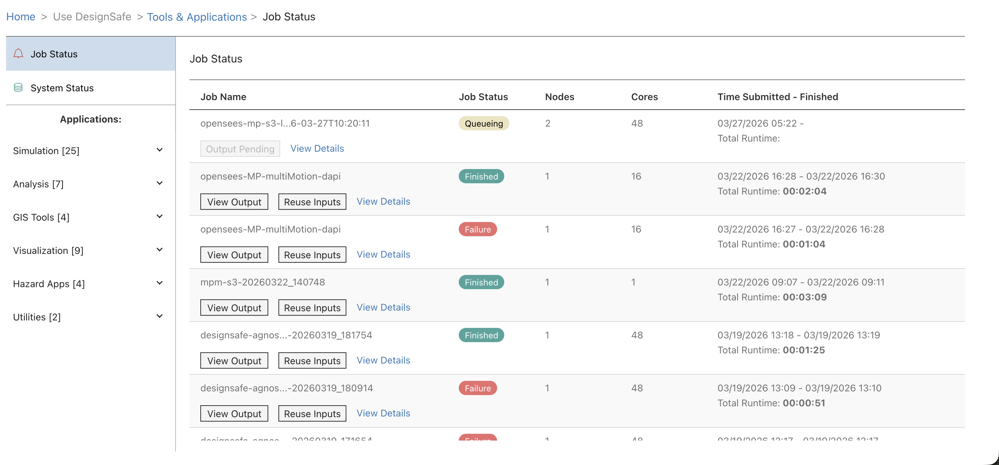

# Submitting a Job Through the Portal

This walkthrough shows how to submit an OpenSees-MP parallel analysis through the [DesignSafe web portal](https://www.designsafe-ci.org/rw/workspace/). The same general process applies to any application available in the portal (OpenFOAM, ADCIRC, MATLAB, etc.).

For submitting jobs programmatically from a Jupyter notebook, see [Running HPC Jobs](job-resources.md).

## Step 1: Find the application

Go to [Use DesignSafe > Tools & Applications](https://www.designsafe-ci.org/rw/workspace/) and find the application under the appropriate category. OpenSees is under **Simulation**.

Click on **OpenSees** to expand the list of OpenSees variants, then select **OpenSeesMP** for parallel analysis.

## Step 2: Select the input directory

The first form page asks for the **Input Directory**, the folder on DesignSafe that contains the OpenSees script and all supporting files (ground motions, material definitions, mesh files, etc.).

Click **Select** to browse Data Depot and choose the folder. The path will be converted to a Tapis URI automatically. The input directory must contain everything the simulation needs, because Tapis copies this entire folder to the compute system before execution.

## Step 3: Set the main script

On the next page, select the **Main Script** that OpenSees should execute. This is the `.tcl` file that drives the analysis.

The script must be inside the input directory selected in the previous step. For OpenSees-MP, the script should be written for parallel execution (using domain decomposition).

## Step 4: Configure resources

Set the allocation, system, queue, runtime, and node count.

| Field | What to enter |
|---|---|
| **Allocation** | Your TACC allocation code (e.g., `ECS24003`). Find yours on the [TACC Dashboard](https://tacc.utexas.edu/portal/dashboard). |
| **System** | The HPC system to run on (e.g., `stampede3`). |
| **Queue** | The queue/partition (e.g., `skx`). Use `skx-dev` for quick tests. See [Compute Environments](compute-environments.md) for queue limits. |
| **Maximum Job Runtime** | Time limit in minutes. SLURM kills jobs that exceed this. Start with 10 minutes for testing. |
| **Number of Nodes** | Physical machines to allocate. For most OpenSees jobs, 1 node is enough. |
| **Cores per Node** | CPU cores per node. For OpenSees-MP, this determines the number of MPI ranks. |

## Step 5: Review and submit

The final page shows the job name, archive system, and archive directory. The summary panel on the right displays all settings. Review them, then click **Submit Job**.

After clicking submit, a confirmation banner appears with a link to the Job Status page.

The bottom-left corner also shows the job entering the queue.

## Step 6: Monitor the job

Go to **Job Status** (linked from the confirmation banner, or from the left sidebar under Tools & Applications). The page shows all submitted jobs with their current status, node count, core count, and runtime.

| Status | Meaning |
|---|---|
| Queueing / Pending | Waiting for SLURM to allocate nodes |
| Running | Executing on compute nodes |
| Finished | Completed successfully |
| Failed | Something went wrong (click **View Output** to see error logs) |

Click **View Output** to browse the archived output files, including `tapisjob.out` (program output) and `tapisjob.err` (error messages). Click **Reuse Inputs** to submit a new job with the same input directory and settings.

## What happens next

After the job finishes, results are archived to the location shown in the Archive Directory field (typically under `jobs-archive` in MyData). Access them from:

- **Data Depot** in the portal (browse to the archive directory)
- **JupyterHub** (navigate to `~/MyData/jobs-archive/...`)
- **dapi** (`job.list_outputs()` and `job.get_output_content()`)

For troubleshooting failed jobs, see [Debugging Failed Jobs](debugging.md).
